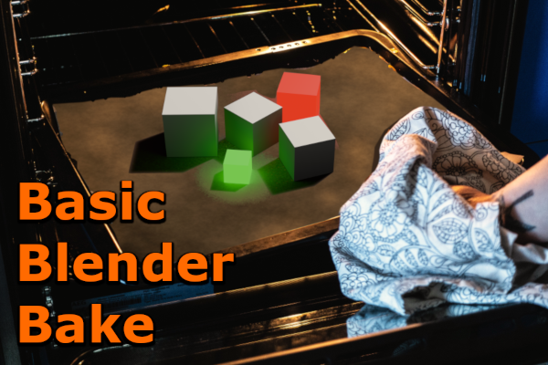
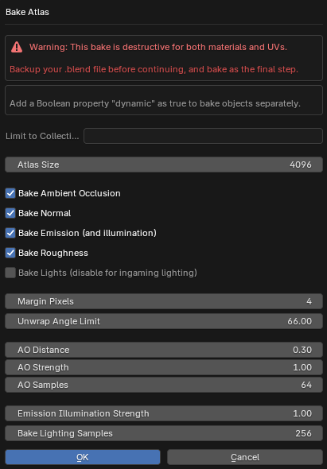
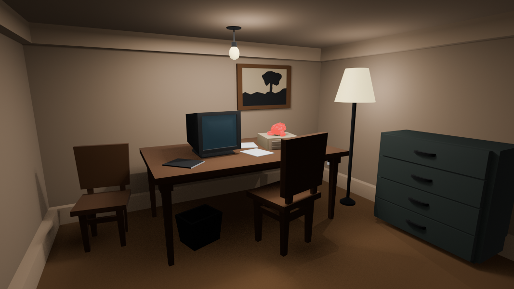
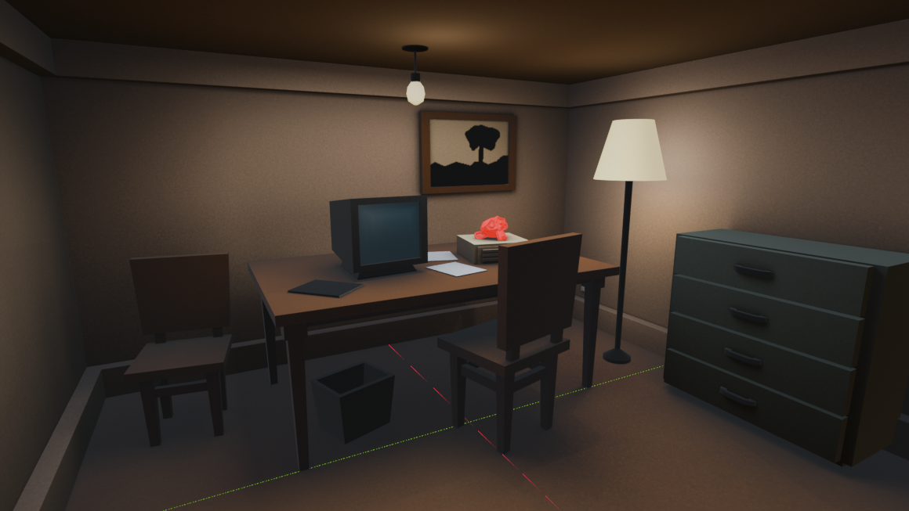
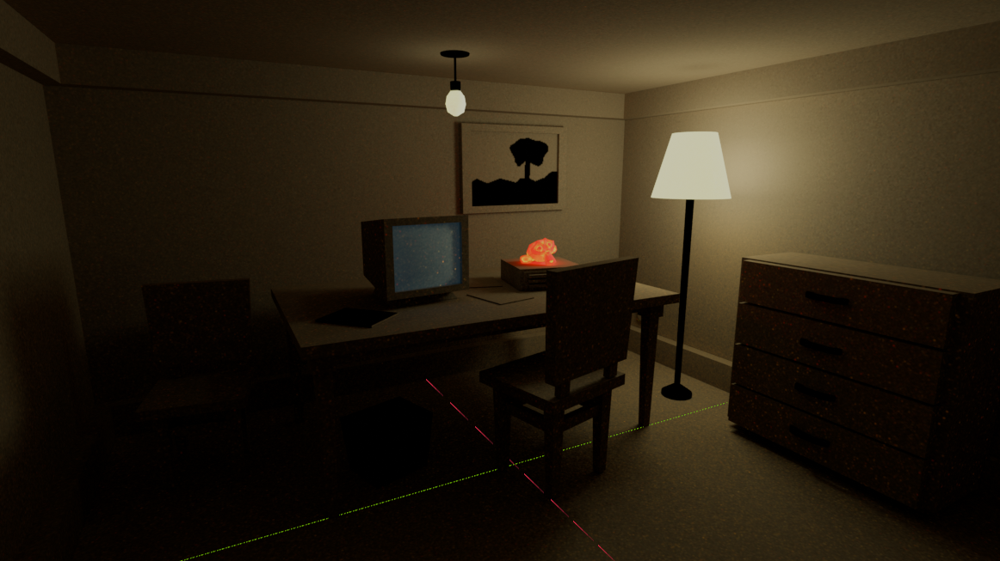
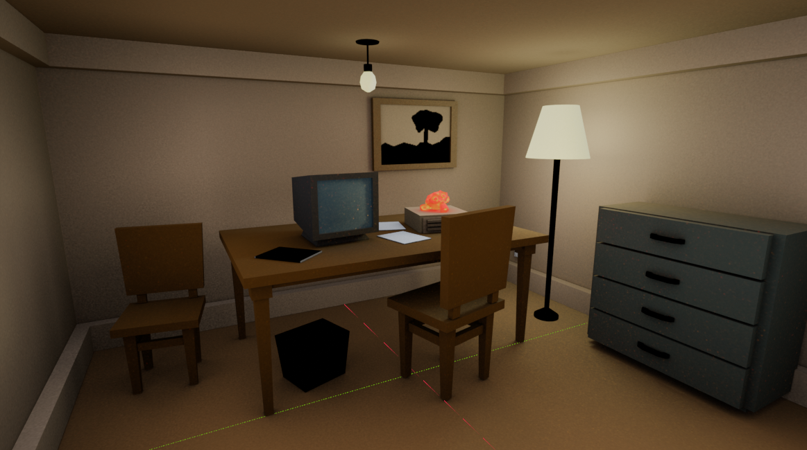
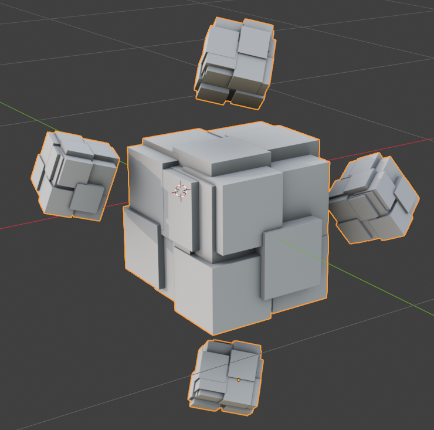

This is a very simple (and somewhat flawed) texture baker for Blender. The addon automatically UV unwraps all meshes in the scene and destructively bakes their materials into texture atlases.

When not baking lights, the baker can bake indirect illumination cast by emissive materials into the emission texture. When baking lights, direct and indirect illumination is baked into the diffuse texture, while the emission texture contains only material emission.

## Install

Simply install `basic_blender_bake.py` as an addon in Blender. You can also call the `bake` function manually from your own exporter. Click the `Bake` tab on the right side of the viewport to bake.

**Note**: Always backup your file before baking. This should always be the last step done before an export.

## Limitations

The baker is inherently using the Cycles renderer. There is currently no denoising. The larger the texture atlas is and the more lighting samples you use, the less noise there will be, but it will also take significantly longer to run.

## Example scene

| Blender EEVEE | Baked Lights — Unlit |
|:---:|:---:|
|  |  |
| **No Baked Lights — Lit** | **No Baked Lights — Unlit** |
|  |  |

**Baked ambient occlusion**

